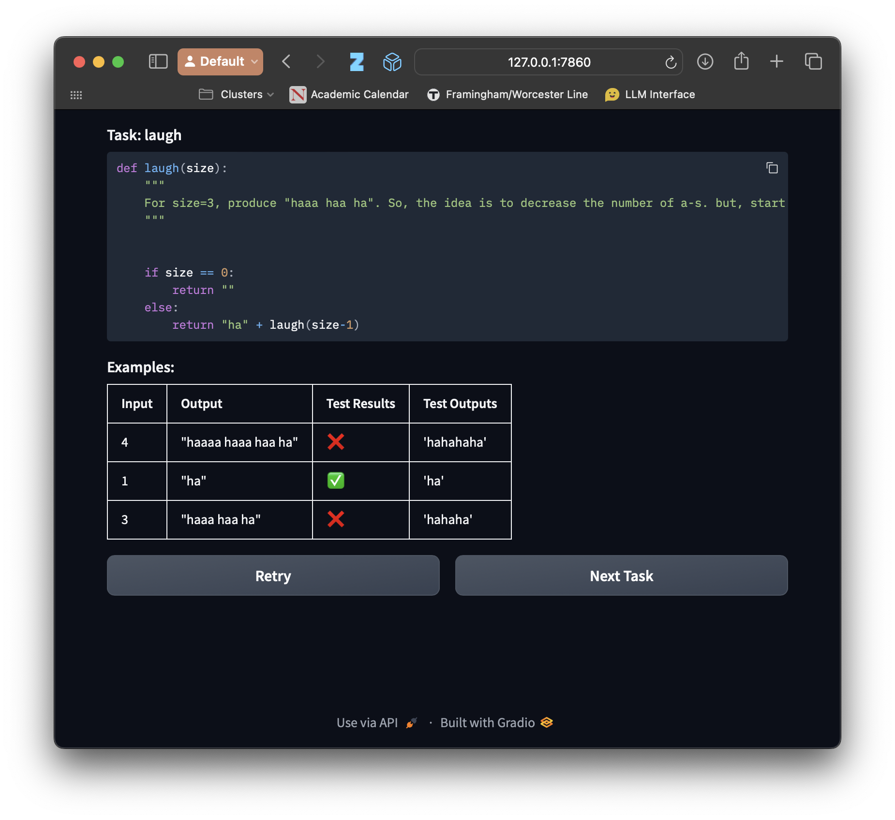

# Charlie the Coding Cow - Classroom Edition



This is a simplified version of the "Charlie the Coding Cow" experiment
platform, designed for classroom use. The original version of this platform was
used in the following papers:

- Hannah Babe, Sydney Nguyen, Yangtian Zi, Arjun Guha, Molly Q Feldman, and
  Carolyn Jane Anderson. StudentEval: a Benchmark of Student-Written Prompts for
  Large Language Models of Code. *ACL Findings 2024*.
- Molly Q Feldman and Carolyn Jane Anderson. Non-Expert Programmers in the
  Generative AI Future. *CHIWORK 2024*.
- Sydney Nguyen, Hannah Babe, Yangtian Zi, Arjun Guha, Carolyn Jane Anderson,
  and Molly Q Feldman. How Beginning Programmers and Code LLMs (Mis)read Each
  Other. *CHI 2024*.

This version features a single sequence of problems for all users (defined in
`tasks.jsonl`), without end-of-problem surveys or a built-in tutorial (which can
be run separately in class). It simplifies data storage by logging all results
to `results_USERNAME.jsonl` files. For authentication, it just uses a list of
usernames without any passwords (defined in `users.txt`)

## Requirements

- Python 3
- `pip3 install gradio openai`
- An LLM endpoint supporting the OpenAI completions API

## Usage

1. Set environment variables:
   - `BASE_URL`
   - `API_KEY`

2. Run the application:
   ```
   python3 app.py --model MODEL_NAME
   ```

3. For more options:
   ```
   python3 app.py --help
   ```